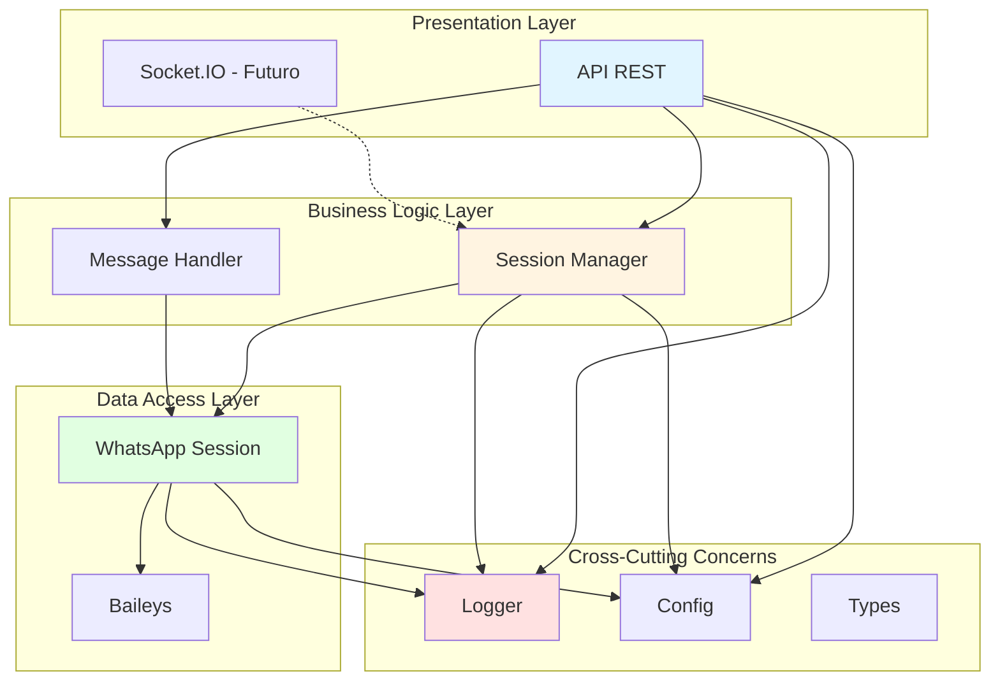
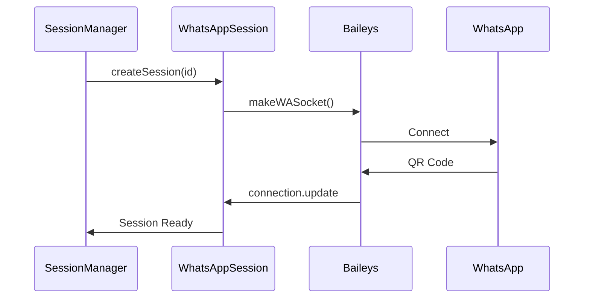
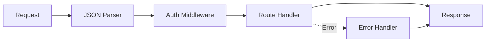
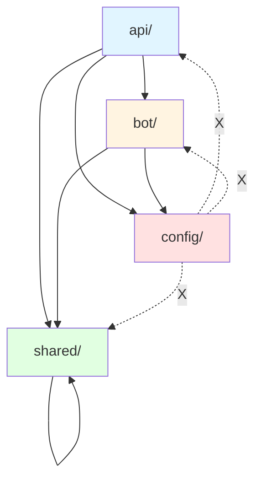
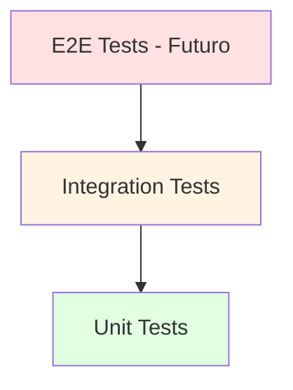
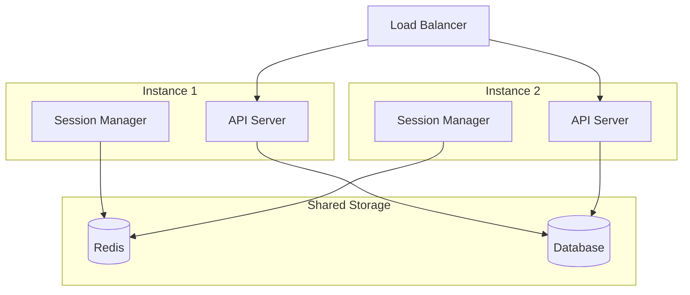
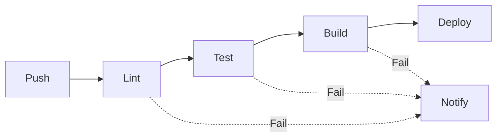

# 🏗️ Arquitetura do Projeto Kowalski

## 📋 Visão Geral

Este documento detalha as decisões arquiteturais, padrões de design e melhores práticas implementadas no projeto Kowalski.

## 🎯 Princípios de Design

### 1. Modularidade

Cada módulo tem responsabilidades bem definidas e pode ser desenvolvido/testado independentemente.

### 2. Separação de Responsabilidades

- **Bot**: Gerencia conexões WhatsApp
- **API**: Interface HTTP para o bot
- **Shared**: Código comum reutilizável
- **Config**: Configurações centralizadas

### 3. Type Safety

TypeScript é usado rigorosamente com configurações estritas para prevenir erros em tempo de compilação.

### 4. Testabilidade

Código projetado para ser facilmente testável com dependências injetáveis e interfaces claras.

## 🏗️ Arquitetura em Camadas



## 📦 Estrutura de Módulos

### Bot Module (`src/bot/`)

**Responsabilidade**: Gerenciar conexões e comunicação com WhatsApp.

**Componentes**:

- `WhatsAppSession`: Encapsula uma conexão Baileys
- `SessionManager`: Gerencia múltiplas sessões

**Dependências**:

- `@whiskeysockets/baileys`
- `@shared` (logger, types)
- `@config`

**Flow**:



### API Module (`src/api/`)

**Responsabilidade**: Fornecer interface HTTP/REST.

**Componentes**:

- `ApiServer`: Servidor Express principal
- `routes/`: Handlers de rotas
- `middlewares/`: Auth, error handling

**Dependências**:

- `express`
- `@bot` (SessionManager)
- `@shared` (types, logger)
- `@config`

**Middleware Chain**:



### Shared Module (`src/shared/`)

**Responsabilidade**: Código comum reutilizável.

**Componentes**:

- `types/`: Interfaces TypeScript
- `utils/`: Funções auxiliares (logger, validators)

**Não possui dependências de outros módulos internos**.

### Config Module (`src/config/`)

**Responsabilidade**: Configurações da aplicação.

**Características**:

- Carrega variáveis de ambiente
- Fornece valores default
- Type-safe através de interface

**Não possui dependências de outros módulos internos**.

## 🔒 Regras de Importação

Para manter a arquitetura limpa, o ESLint força estas regras:



**Regras**:

- ✅ `api/` pode importar: `bot/`, `shared/`, `config/`
- ✅ `bot/` pode importar: `shared/`, `config/`
- ✅ `shared/` pode importar: apenas `shared/`
- ❌ `config/` não pode importar nenhum módulo interno

Isso previne:

- Dependências circulares
- Acoplamento excessivo
- Dificuldade de teste
- Problemas de manutenção

## 🎨 Padrões de Design Aplicados

### 1. Singleton Pattern

`SessionManager` gerencia instâncias únicas de sessões.

```typescript
class SessionManager {
  private sessions: Map<string, WhatsAppSession> = new Map();

  public getSession(id: string): WhatsAppSession | undefined {
    return this.sessions.get(id);
  }
}
```

### 2. Factory Pattern

Criação de sessões através do SessionManager.

```typescript
const session = await sessionManager.createSession('user-1');
```

### 3. Observer Pattern

Eventos do Baileys são tratados através de callbacks.

```typescript
session.onQR((qr) => console.log(qr));
session.onConnected(() => console.log('Connected!'));
```

### 4. Dependency Injection

O ApiServer recebe o SessionManager como dependência.

```typescript
const apiServer = new ApiServer(port, sessionManager);
```

### 5. Middleware Pattern

Express middlewares para cross-cutting concerns.

```typescript
app.use(authMiddleware);
app.use(errorHandler);
```

## 🧪 Estratégia de Testes

### Pirâmide de Testes



### Unit Tests

- Testam funções e classes isoladamente
- Usam mocks para dependências
- Rápidos e numerosos

**Exemplo**: `session-manager.test.ts`

### Integration Tests

- Testam interação entre módulos
- Testam rotas API com Express
- Usam mocks apenas para serviços externos

**Exemplo**: `routes.test.ts`

### Coverage Goals

- Statements: > 80%
- Branches: > 75%
- Functions: > 80%
- Lines: > 80%

## 📝 Convenções de Código

### Nomenclatura

| Tipo       | Convenção        | Exemplo              |
| ---------- | ---------------- | -------------------- |
| Variáveis  | camelCase        | `sessionId`          |
| Constantes | UPPER_SNAKE_CASE | `MAX_RETRIES`        |
| Classes    | PascalCase       | `SessionManager`     |
| Interfaces | PascalCase       | `MessagePayload`     |
| Arquivos   | kebab-case       | `session-manager.ts` |
| Pastas     | kebab-case       | `shared-utils`       |

### Estrutura de Arquivos

```
module/
├── index.ts           # Exports públicos
├── main-feature.ts    # Feature principal
├── helper.ts          # Helpers
├── __tests__/         # Testes
│   └── main-feature.test.ts
└── README.md          # Documentação
```

### Imports

Ordenados por:

1. Bibliotecas externas (node_modules)
2. Módulos internos (@aliases)
3. Imports relativos

```typescript
// External
import express from 'express';
import pino from 'pino';

// Internal
import { SessionManager } from '@bot';
import { config } from '@config';
import { logger } from '@shared/utils/logger';

// Relative
import { helper } from './helper';
```

## 🔐 Segurança

### Autenticação

- API Key via headers
- Validação em middleware
- Não expor keys em logs

### Autorização (Futuro)

- JWT tokens
- Role-based access control
- Session-level permissions

### Data Protection

- Não commitar arquivos de sessão
- Criptografar credenciais em prod
- HTTPS obrigatório em produção

## 📊 Logging

### Structured Logging com Pino

```typescript
logger.info({ sessionId, userId }, 'Session created');
logger.error({ err, context }, 'Failed to send message');
```

**Níveis**:

- `trace`: Detalhes muito verbosos
- `debug`: Informações de debug
- `info`: Informações gerais
- `warn`: Avisos
- `error`: Erros
- `fatal`: Erros fatais

### Log Context

Sempre incluir contexto relevante:

- IDs (session, user, message)
- Timestamps
- Error objects
- Metadata relevante

## 🚀 Performance

### Considerações

1. **Conexões WhatsApp**
   - Pool de conexões
   - Reconnect com backoff
   - Health checks

2. **API Response Time**
   - Async/await adequado
   - Timeouts configurados
   - Streaming para arquivos grandes

3. **Memory Management**
   - Cleanup de sessões antigas
   - Limitar mensagens em memória
   - Garbage collection awareness

## 📈 Escalabilidade

### Horizontal Scaling (Futuro)



**Requisitos**:

- Redis para session state
- Database para persistência
- Sticky sessions ou session affinity
- Message queue para processamento

## 🔄 CI/CD Pipeline (Futuro)



**Steps**:

1. Lint code
2. Run tests
3. Build TypeScript
4. Docker image
5. Deploy to cloud

## 📚 Referências

- [Baileys Documentation](https://whiskey.so/docs)
- [Express Best Practices](https://expressjs.com/en/advanced/best-practice-security.html)
- [TypeScript Handbook](https://www.typescriptlang.org/docs/handbook/intro.html)
- [Clean Architecture](https://blog.cleancoder.com/uncle-bob/2012/08/13/the-clean-architecture.html)

## ✅ Checklist de Implementação

Ao adicionar uma nova feature:

- [ ] Definir interface/tipos em `shared/types`
- [ ] Implementar lógica no módulo apropriado
- [ ] Adicionar testes unitários
- [ ] Adicionar testes de integração
- [ ] Documentar no README do módulo
- [ ] Atualizar diagramas Mermaid
- [ ] Validar regras de importação
- [ ] Verificar coverage de testes
- [ ] Adicionar logs apropriados
- [ ] Considerar tratamento de erros

---

**Última atualização**: 30 de setembro de 2025
**Versão**: 1.0.0
