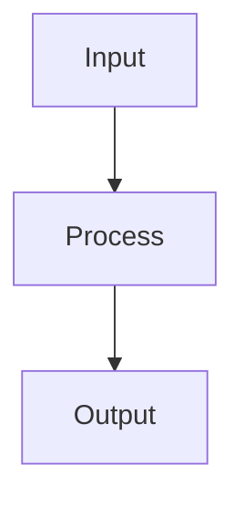

# 🤝 Guia de Contribuição

Obrigado por considerar contribuir com o Kowalski! Este documento fornece diretrizes para contribuir com o projeto.

## 📋 Código de Conduta

- Seja respeitoso e inclusivo
- Aceite críticas construtivas
- Foque no que é melhor para a comunidade
- Mostre empatia com outros membros

## 🚀 Como Contribuir

### Reportando Bugs

1. **Verifique se o bug já foi reportado** nas [Issues](https://github.com/sudomagidex/kowalski/issues)
2. Se não encontrar, abra uma nova issue incluindo:
   - Descrição clara do bug
   - Passos para reproduzir
   - Comportamento esperado vs atual
   - Screenshots se aplicável
   - Versão do Node.js e sistema operacional
   - Logs relevantes

### Sugerindo Melhorias

1. Abra uma issue com a tag `enhancement`
2. Descreva detalhadamente a melhoria
3. Explique por que seria útil
4. Se possível, sugira uma implementação

### Pull Requests

#### Preparação

1. **Fork o repositório**
2. **Clone seu fork**
   ```bash
   git clone https://github.com/seu-usuario/kowalski.git
   cd kowalski
   ```
3. **Adicione o remote upstream**
   ```bash
   git remote add upstream https://github.com/sudomagidex/kowalski.git
   ```
4. **Crie uma branch**
   ```bash
   git checkout -b feature/minha-feature
   # ou
   git checkout -b fix/meu-fix
   ```

#### Desenvolvimento

1. **Instale as dependências**

   ```bash
   npm install
   ```

2. **Faça suas alterações**
   - Siga os padrões de código (ESLint + Prettier)
   - Adicione testes para novas funcionalidades
   - Atualize a documentação se necessário

3. **Execute os testes**

   ```bash
   npm test
   npm run lint
   ```

4. **Commit suas mudanças**
   ```bash
   git add .
   git commit -m "feat: adiciona nova funcionalidade"
   ```

#### Convenções de Commit

Seguimos o [Conventional Commits](https://www.conventionalcommits.org/):

- `feat:` Nova funcionalidade
- `fix:` Correção de bug
- `docs:` Apenas documentação
- `style:` Formatação, sem mudança de código
- `refactor:` Refatoração de código
- `test:` Adição/correção de testes
- `chore:` Tarefas de manutenção

**Exemplos**:

```bash
feat: adiciona suporte a envio de vídeos
fix: corrige reconexão automática
docs: atualiza README com exemplos
test: adiciona testes para SessionManager
```

#### Enviando o PR

1. **Push para seu fork**

   ```bash
   git push origin feature/minha-feature
   ```

2. **Abra um Pull Request** no GitHub

3. **Descreva suas mudanças**:
   - O que foi alterado
   - Por que foi alterado
   - Como testar
   - Issues relacionadas (#123)

4. **Aguarde review**
   - Responda aos comentários
   - Faça as alterações solicitadas
   - Mantenha o PR atualizado com a main

## 📝 Padrões de Código

### TypeScript

- Use tipos explícitos sempre que possível
- Evite `any`
- Prefira interfaces a types quando possível
- Use arrow functions para callbacks

### Nomenclatura

```typescript
// Classes: PascalCase
class SessionManager {}

// Interfaces: PascalCase
interface MessagePayload {}

// Variáveis/Funções: camelCase
const sessionId = 'test';
function sendMessage() {}

// Constantes: UPPER_SNAKE_CASE
const MAX_RETRIES = 3;

// Arquivos: kebab-case
// session-manager.ts
// message-handler.ts
```

### Estrutura de Arquivos

```typescript
// Imports em ordem
import { external } from 'package'; // 1. Externos

import { internal } from '@module'; // 2. Internos (aliases)

import { local } from './local'; // 3. Locais

// Exports no final
export { Something };
```

### Comentários

```typescript
// ✅ BOM: Explica o "porquê"
// Reconnect with exponential backoff to avoid rate limiting
await reconnect();

// ❌ RUIM: Explica o "o quê" (óbvio)
// Set counter to 0
counter = 0;

// ✅ BOM: JSDoc para funções públicas
/**
 * Send a text message to a WhatsApp number
 * @param to - Phone number with country code
 * @param text - Message text
 * @throws {Error} If session is not connected
 */
async function sendMessage(to: string, text: string): Promise<void>;
```

## 🧪 Testes

### Estrutura de Testes

```typescript
describe('ComponentName', () => {
  // Setup
  beforeEach(() => {
    // Preparação
  });

  // Cleanup
  afterEach(() => {
    // Limpeza
  });

  describe('methodName', () => {
    it('should do something specific', () => {
      // Arrange
      const input = 'test';

      // Act
      const result = doSomething(input);

      // Assert
      expect(result).toBe('expected');
    });
  });
});
```

### Coverage

Mantenha coverage acima de:

- Statements: 80%
- Branches: 75%
- Functions: 80%
- Lines: 80%

```bash
npm run test:coverage
```

### Testes Necessários

Para cada nova funcionalidade:

1. **Testes unitários**
   - Teste a função isoladamente
   - Mock dependências externas
   - Teste casos de erro

2. **Testes de integração**
   - Teste interação entre módulos
   - Teste rotas da API
   - Teste fluxos completos

3. **Documentação**
   - README do módulo
   - Comentários no código
   - Exemplos de uso

## 📚 Documentação

### README.md do Módulo

Cada módulo deve ter um README com:

1. **Visão Geral**: O que faz
2. **Arquitetura**: Como funciona (diagrama Mermaid)
3. **API**: Funções/classes exportadas
4. **Uso**: Exemplos de código
5. **Testes**: Como testar
6. **Considerações**: Segurança, performance

### Diagramas Mermaid

Use Mermaid para diagramas:



## 🔍 Revisão de Código

### Como Revisor

- ✅ Seja construtivo e respeitoso
- ✅ Explique o "porquê" das sugestões
- ✅ Aprove se atende aos requisitos
- ✅ Teste localmente quando necessário

### Como Autor

- ✅ Responda a todos os comentários
- ✅ Não leve críticas para o pessoal
- ✅ Explique suas decisões
- ✅ Agradeça o feedback

## 🏆 Reconhecimento

Contribuidores serão:

- Listados no README principal
- Mencionados no release notes
- Reconhecidos na documentação

## 📋 Checklist do PR

Antes de abrir o PR, verifique:

- [ ] Código segue os padrões (lint passa)
- [ ] Testes adicionados e passando
- [ ] Coverage mantido acima de 80%
- [ ] Documentação atualizada
- [ ] README do módulo atualizado se necessário
- [ ] Sem conflitos com main
- [ ] Commits seguem convenção
- [ ] Descrição do PR completa

## 🎯 Prioridades

Áreas que precisam de contribuição:

1. **Alta Prioridade**
   - Testes adicionais
   - Documentação
   - Correção de bugs
   - Performance

2. **Média Prioridade**
   - Novas features do roadmap
   - Melhorias de UX
   - Refatorações

3. **Baixa Prioridade**
   - Otimizações
   - Features experimentais

## 💬 Comunicação

- **GitHub Issues**: Para bugs e features
- **Pull Requests**: Para discussão de código
- **WhatsApp Group**: Para discussões gerais

## 🎓 Recursos

- [TypeScript Handbook](https://www.typescriptlang.org/docs/)
- [Express Best Practices](https://expressjs.com/en/advanced/best-practice-security.html)
- [Jest Documentation](https://jestjs.io/docs/getting-started)
- [Conventional Commits](https://www.conventionalcommits.org/)

## ❓ Dúvidas

Não hesite em perguntar! Abra uma issue com a tag `question` ou pergunte no grupo do WhatsApp.

---

**Obrigado por contribuir! 🙏**
