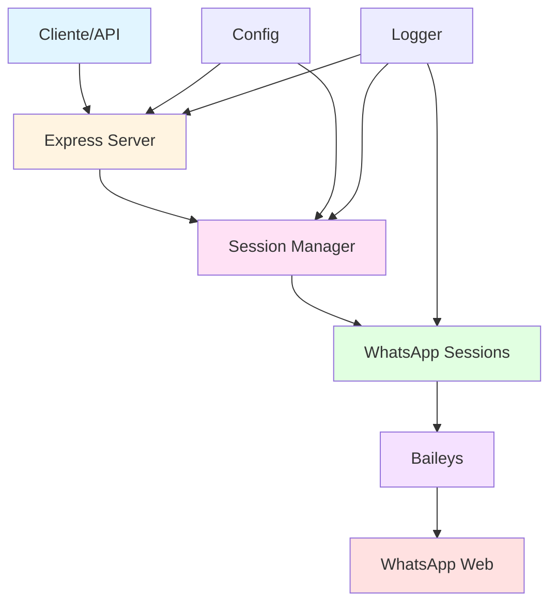

# 🤖 Kowalski - WhatsApp Bot com Baileys

Uma automação completa para WhatsApp que envia e recebe mensagens dos mais variados modos, com interface web e API REST.

[](https://www.typescriptlang.org/)
[](https://nodejs.org/)
[](LICENSE)

## 📋 Índice

- [Sobre](#sobre)
- [Arquitetura](#arquitetura)
- [Estrutura do Projeto](#estrutura-do-projeto)
- [Instalação](#instalação)
- [Configuração](#configuração)
- [Uso](#uso)
- [API](#api)
- [Testes](#testes)
- [Desenvolvimento](#desenvolvimento)
- [Roadmap](#roadmap)

## 🎯 Sobre

Kowalski é um bot WhatsApp modular e escalável construído com:

- **Baileys**: Biblioteca WhatsApp Web API
- **Express**: API REST para integração
- **TypeScript**: Type safety e melhor DX
- **Jest**: Testes unitários e de integração

## 🏗️ Arquitetura



## 📁 Estrutura do Projeto

```
kowalski/
├── src/
│   ├── api/              # API REST (Express)
│   │   ├── middlewares/  # Auth, error handling
│   │   ├── routes/       # Endpoints
│   │   └── README.md
│   ├── bot/              # WhatsApp Bot (Baileys)
│   │   ├── session.ts
│   │   ├── session-manager.ts
│   │   └── README.md
│   ├── config/           # Configurações
│   │   └── README.md
│   ├── shared/           # Utilidades compartilhadas
│   │   ├── types/        # TypeScript types
│   │   ├── utils/        # Helpers
│   │   └── README.md
│   └── index.ts          # Entry point
├── __tests__/            # Testes
├── sessions/             # Sessões WhatsApp (gitignored)
├── .env                  # Variáveis de ambiente
├── .eslintrc.json        # ESLint config
├── .prettierrc           # Prettier config
├── jest.config.js        # Jest config
├── tsconfig.json         # TypeScript config
└── package.json
```

Cada módulo possui seu próprio `README.md` com documentação detalhada.

## 🚀 Instalação

### Pré-requisitos

- Node.js 18+
- pnpm (recomendado) ou npm

### Passos

```bash
# Clone o repositório
git clone https://github.com/sudomagidex/kowalski.git
cd kowalski

# Instale as dependências
pnpm install

# Copie o arquivo de ambiente
cp .env.example .env

# Edite as variáveis de ambiente
nano .env
```

## ⚙️ Configuração

Edite o arquivo `.env`:

```env
# Server
PORT=3000
NODE_ENV=development

# API
API_KEY=your-secure-api-key-here

# WhatsApp
SESSION_DIR=./sessions
QR_TIMEOUT=60000

# Logging
LOG_LEVEL=info
```

## 💻 Uso

### Desenvolvimento

```bash
# Modo desenvolvimento (hot reload)
pnpm dev
```

### Produção

```bash
# Build
pnpm build

# Start
pnpm start
```

### Conectar WhatsApp

1. Inicie o servidor
2. Faça uma requisição POST para criar uma sessão
3. Escaneie o QR Code exibido no terminal
4. Comece a enviar mensagens!

```bash
# Criar sessão
curl -X POST http://localhost:3000/api/sessions \
  -H "x-api-key: your-key" \
  -H "Content-Type: application/json" \
  -d '{"sessionId": "default"}'

# Enviar mensagem
curl -X POST http://localhost:3000/api/messages/send \
  -H "x-api-key: your-key" \
  -H "Content-Type: application/json" \
  -d '{
    "to": "5511999999999",
    "text": "Hello from Kowalski!"
  }'
```

## 📡 API

### Autenticação

Todas as rotas (exceto `/health`) requerem o header:

```
x-api-key: your-api-key
```

### Endpoints

| Método | Endpoint             | Descrição        |
| ------ | -------------------- | ---------------- |
| GET    | `/health`            | Health check     |
| GET    | `/api/sessions`      | Listar sessões   |
| POST   | `/api/sessions`      | Criar sessão     |
| GET    | `/api/sessions/:id`  | Status da sessão |
| DELETE | `/api/sessions/:id`  | Deletar sessão   |
| POST   | `/api/messages/send` | Enviar mensagem  |

Documentação completa: [src/api/README.md](src/api/README.md)

## 🧪 Testes

```bash
# Executar testes
pnpm test

# Testes em watch mode
pnpm test:watch

# Coverage
pnpm test:coverage
```

## 🛠️ Desenvolvimento

### Scripts Disponíveis

```bash
pnpm dev          # Desenvolvimento
pnpm build        # Build para produção
pnpm start        # Iniciar produção
pnpm test         # Testes
pnpm lint         # Lint
pnpm lint:fix     # Lint + fix
pnpm format       # Format com Prettier
pnpm format:check # Verificar formatação
```

### Code Quality

O projeto usa:

- **ESLint**: Linting com regras rigorosas
- **Prettier**: Formatação de código
- **Husky**: Git hooks
- **lint-staged**: Lint apenas arquivos staged

### Commits

Husky executa automaticamente:

- Lint dos arquivos modificados
- Formatação automática
- Testes relacionados

```bash
git add .
git commit -m "feat: add new feature"
# Husky irá rodar os checks automaticamente
```

### Estrutura de Pastas

O ESLint força uma arquitetura modular:

- `api/` pode importar de `bot/`, `shared/`, `config/`
- `bot/` pode importar de `shared/`, `config/`
- `shared/` pode importar apenas de `shared/`
- `config/` não pode importar de outros módulos

Isso previne dependências circulares e mantém a arquitetura limpa.

## 📊 Monitoramento

Logs estruturados com Pino:

```typescript
import { logger } from '@shared/utils/logger';

logger.info('Application started');
logger.error({ err: error }, 'Failed to connect');
logger.debug({ data }, 'Processing data');
```

## 🔒 Segurança

- API Key authentication
- Sessões armazenadas localmente (não commitadas)
- Validação de entrada
- Rate limiting recomendado para produção
- HTTPS obrigatório em produção

## 🎯 Roadmap

Ver [README.md](README.md) principal para roadmap completo.

### Fase Atual: Fase 2-4

- [x] Configuração do projeto
- [x] Estrutura modular
- [x] Conexão com WhatsApp (Baileys)
- [x] API REST básica
- [ ] Interface web
- [ ] Funcionalidades avançadas

## 🤝 Contribuindo

1. Fork o projeto
2. Crie uma branch (`git checkout -b feature/amazing`)
3. Commit suas mudanças (`git commit -m 'feat: add amazing'`)
4. Push para a branch (`git push origin feature/amazing`)
5. Abra um Pull Request

## 📝 Licença

ISC License - veja [LICENSE](LICENSE) para detalhes.

## 👥 Autores

- **SudoMagidex Team**

## 🙏 Agradecimentos

- [Baileys](https://github.com/WhiskeySockets/Baileys) - WhatsApp Web API
- [Express](https://expressjs.com/) - Web framework
- Comunidade open source

## 📞 Suporte

- GitHub Issues: [Issues](https://github.com/sudomagidex/kowalski/issues)
- Documentação: Ver READMEs em cada módulo

---

Feito com ❤️ pela equipe SudoMagidex
