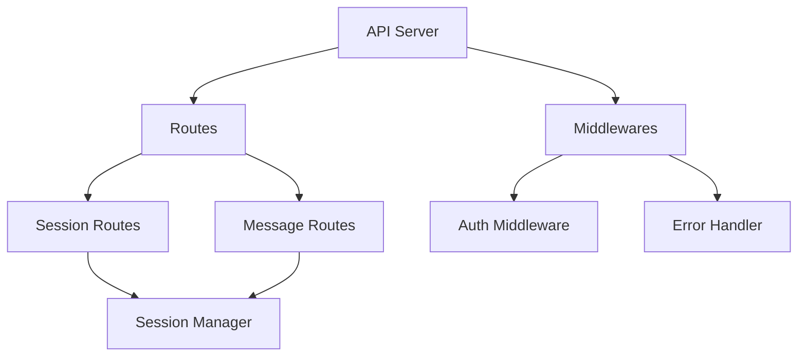
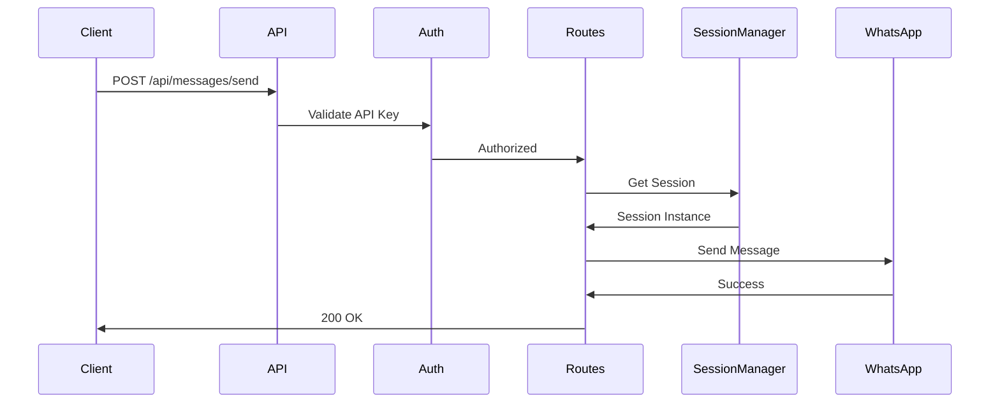

# API Module

## 📋 Overview

RESTful API built with Express.js for managing WhatsApp sessions and sending messages. Provides a clean HTTP interface to interact with the WhatsApp bot.

## 🏗️ Architecture



## 📁 Structure

```
api/
├── server.ts              # Express server setup
├── routes/
│   └── index.ts          # Route handlers
├── middlewares/
│   ├── auth.ts           # API key authentication
│   └── error-handler.ts  # Global error handling
├── index.ts              # Module exports
└── README.md             # This file
```

## 🎯 Components

### ApiServer

Main server class that orchestrates the API.

**Features:**

- Express app configuration
- Route registration
- Middleware setup
- Error handling
- Health check endpoint

### Middlewares

#### Authentication

Validates API key in `x-api-key` header.

```typescript
headers: {
  'x-api-key': 'your-api-key'
}
```

#### Error Handler

Global error catching and formatting.

## 📚 API Endpoints

### Health Check

```
GET /health
```

Check if the API is running.

**Response:**

```json
{
  "status": "ok",
  "timestamp": "2025-09-30T12:00:00.000Z"
}
```

### Session Management

#### List All Sessions

```
GET /api/sessions
Headers: x-api-key: <your-key>
```

**Response:**

```json
{
  "success": true,
  "data": [
    {
      "id": "default",
      "status": "connected"
    }
  ]
}
```

#### Create Session

```
POST /api/sessions
Headers: x-api-key: <your-key>
Content-Type: application/json

Body:
{
  "sessionId": "my-session"
}
```

**Response:**

```json
{
  "success": true,
  "data": {
    "id": "my-session",
    "status": "qr"
  },
  "message": "Session created successfully"
}
```

#### Get Session Status

```
GET /api/sessions/:sessionId
Headers: x-api-key: <your-key>
```

**Response:**

```json
{
  "success": true,
  "data": {
    "id": "my-session",
    "status": "connected"
  }
}
```

#### Delete Session

```
DELETE /api/sessions/:sessionId
Headers: x-api-key: <your-key>
```

**Response:**

```json
{
  "success": true,
  "message": "Session deleted successfully"
}
```

### Message Sending

#### Send Message

```
POST /api/messages/send
Headers: x-api-key: <your-key>
Content-Type: application/json

Body (text):
{
  "sessionId": "default",
  "to": "5511999999999",
  "text": "Hello, World!"
}

Body (image):
{
  "sessionId": "default",
  "to": "5511999999999",
  "type": "image",
  "mediaUrl": "https://example.com/image.jpg",
  "caption": "Check this out!"
}
```

**Response:**

```json
{
  "success": true,
  "message": "Message sent successfully"
}
```

## 🔄 Request Flow



## 📖 Usage Examples

### cURL

```bash
# Create session
curl -X POST http://localhost:3000/api/sessions \
  -H "x-api-key: your-key" \
  -H "Content-Type: application/json" \
  -d '{"sessionId": "test"}'

# Send message
curl -X POST http://localhost:3000/api/messages/send \
  -H "x-api-key: your-key" \
  -H "Content-Type: application/json" \
  -d '{
    "to": "5511999999999",
    "text": "Hello from API!"
  }'
```

### JavaScript/Node.js

```javascript
const axios = require('axios');

const api = axios.create({
  baseURL: 'http://localhost:3000/api',
  headers: {
    'x-api-key': 'your-key',
    'Content-Type': 'application/json',
  },
});

// Create session
await api.post('/sessions', {
  sessionId: 'my-session',
});

// Send message
await api.post('/messages/send', {
  to: '5511999999999',
  text: 'Hello!',
});
```

### Python

```python
import requests

headers = {
    'x-api-key': 'your-key',
    'Content-Type': 'application/json'
}

# Create session
response = requests.post(
    'http://localhost:3000/api/sessions',
    headers=headers,
    json={'sessionId': 'my-session'}
)

# Send message
response = requests.post(
    'http://localhost:3000/api/messages/send',
    headers=headers,
    json={
        'to': '5511999999999',
        'text': 'Hello from Python!'
    }
)
```

## 🔒 Authentication

The API uses API key authentication via headers:

```
x-api-key: your-api-key-here
```

Configure your API key in `.env`:

```
API_KEY=your-secure-key-here
```

**Security Best Practices:**

- Use strong, random API keys
- Rotate keys regularly
- Use HTTPS in production
- Implement rate limiting
- Log authentication attempts

## ⚠️ Error Responses

All errors follow this format:

```json
{
  "success": false,
  "error": "Error message",
  "message": "User-friendly message"
}
```

### Common Status Codes

| Code | Meaning      | Example                |
| ---- | ------------ | ---------------------- |
| 200  | Success      | Request completed      |
| 201  | Created      | Session created        |
| 400  | Bad Request  | Missing parameters     |
| 401  | Unauthorized | Invalid API key        |
| 404  | Not Found    | Session not found      |
| 409  | Conflict     | Session already exists |
| 500  | Server Error | Internal error         |

## 🧪 Testing

### Manual Testing

Use tools like:

- Postman
- Insomnia
- cURL
- Thunder Client (VS Code)

### Automated Testing

```typescript
describe('API Routes', () => {
  it('should create a session', async () => {
    const response = await request(app)
      .post('/api/sessions')
      .set('x-api-key', 'test-key')
      .send({ sessionId: 'test' });

    expect(response.status).toBe(201);
    expect(response.body.success).toBe(true);
  });
});
```

## 📊 Rate Limiting

**Recommended limits for production:**

- 100 requests per minute per IP
- 1000 requests per hour per API key
- Special limits for message sending

```typescript
import rateLimit from 'express-rate-limit';

const limiter = rateLimit({
  windowMs: 60 * 1000, // 1 minute
  max: 100,
});

app.use('/api', limiter);
```

## 🚀 Future Enhancements

- [ ] WebSocket support for real-time updates
- [ ] OAuth2 authentication
- [ ] Rate limiting
- [ ] Request validation with Joi/Zod
- [ ] API documentation with Swagger
- [ ] Webhook support
- [ ] Message templates
- [ ] Bulk message sending
- [ ] Message scheduling
- [ ] Analytics endpoints

## ✅ Best Practices

1. **Always validate input data**
2. **Use proper HTTP status codes**
3. **Implement request timeout**
4. **Log all API requests**
5. **Version your API (/api/v1/...)**
6. **Document all endpoints**
7. **Handle errors gracefully**
8. **Implement CORS properly**
9. **Use compression middleware**
10. **Monitor API performance**
