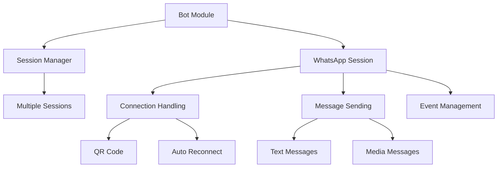
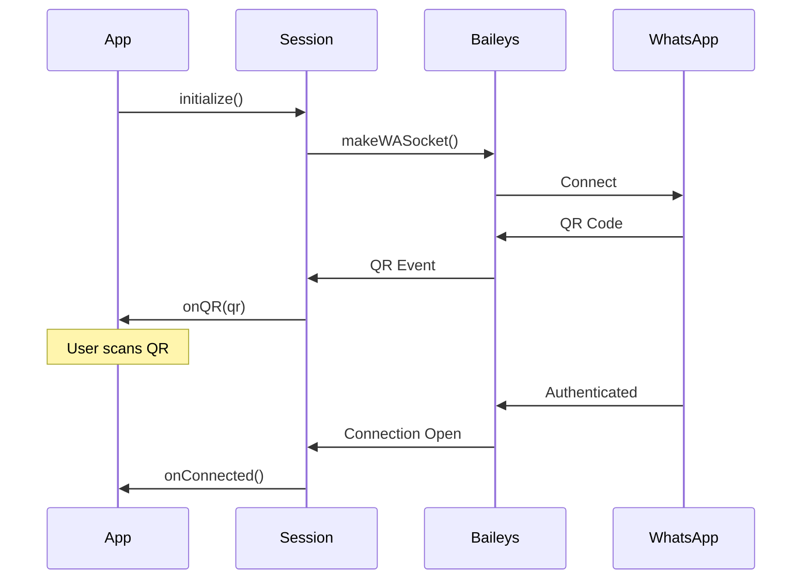

# Bot Module

## 📋 Overview

This module handles all WhatsApp connection and messaging functionality using the Baileys library. It provides a clean abstraction over Baileys' WebSocket protocol implementation.

## 🏗️ Architecture



## 📁 Structure

```
bot/
├── session.ts           # WhatsApp session handler
├── session-manager.ts   # Multi-session management
├── index.ts            # Module exports
└── README.md           # This file
```

## 🎯 Core Components

### WhatsAppSession

Manages individual WhatsApp connections using Baileys.

**Features:**

- QR Code generation for authentication
- Automatic reconnection on disconnect
- Message sending (text, images, etc.)
- Event-based architecture
- Session persistence

**Key Methods:**

```typescript
initialize(): Promise<void>         // Start session
sendTextMessage(to, text): void     // Send text
sendImageMessage(to, url): void     // Send image
onQR(callback): void                // QR code event
onConnected(callback): void         // Connection event
isConnected(): boolean              // Check status
disconnect(): Promise<void>         // Close session
```

### SessionManager

Handles multiple WhatsApp sessions simultaneously.

**Features:**

- Create and manage multiple sessions
- Session lifecycle management
- Session retrieval and deletion
- Multi-device support

**Key Methods:**

```typescript
createSession(id): Promise<Session>  // Create new session
getSession(id): Session | undefined  // Get existing session
getAllSessions(): Session[]          // List all sessions
deleteSession(id): Promise<boolean>  // Remove session
hasSession(id): boolean              // Check existence
```

## 📖 Usage

### Single Session

```typescript
import { WhatsAppSession } from '@bot';

const session = new WhatsAppSession('my-session');

session.onQR((qr) => {
  console.log('Scan this QR:', qr);
});

session.onConnected(() => {
  console.log('Connected!');
});

await session.initialize();
await session.sendTextMessage('5511999999999', 'Hello!');
```

### Multiple Sessions

```typescript
import { SessionManager } from '@bot';

const manager = new SessionManager();

const session1 = await manager.createSession('user-1');
const session2 = await manager.createSession('user-2');

const allSessions = manager.getAllSessions();
console.log(`Active sessions: ${allSessions.length}`);
```

## 🔄 Connection Flow



## 🔧 Configuration

Sessions are stored in the directory specified by `SESSION_DIR` environment variable:

```
sessions/
├── default/
│   ├── creds.json
│   └── app-state-sync-*.json
└── user-1/
    ├── creds.json
    └── app-state-sync-*.json
```

## ⚠️ Important Notes

### Authentication State

The `useMultiFileAuthState` is used for demo purposes. For production:

- Implement custom auth state storage
- Use database (Redis, PostgreSQL)
- Consider encryption for credentials
- Implement proper cleanup

### Reconnection Logic

- Automatic reconnection on network issues
- No reconnection on logout
- Exponential backoff recommended for production

### Rate Limiting

WhatsApp has rate limits:

- ~1000 messages per day for new numbers
- Gradual increase for established accounts
- Respect rate limits to avoid bans

## 🧪 Testing

Tests should cover:

- Session initialization
- Connection lifecycle
- Message sending
- Error handling
- Reconnection logic

```typescript
describe('WhatsAppSession', () => {
  it('should initialize successfully', async () => {
    const session = new WhatsAppSession('test');
    await session.initialize();
    expect(session.getSessionId()).toBe('test');
  });
});
```

## 🚨 Error Handling

Common errors and solutions:

| Error                  | Cause                     | Solution                 |
| ---------------------- | ------------------------- | ------------------------ |
| Socket not initialized | Sending before connection | Wait for `onConnected`   |
| QR timeout             | QR not scanned in time    | Regenerate QR            |
| Connection closed      | Network/logout            | Check reconnection logic |
| Rate limit             | Too many messages         | Implement throttling     |

## ✅ Best Practices

1. **Always handle disconnections gracefully**
2. **Implement proper error logging**
3. **Use callbacks for async events**
4. **Clean up sessions on app shutdown**
5. **Store credentials securely**
6. **Validate phone numbers before sending**
7. **Implement message queuing for high volume**

## 🔒 Security

- Never expose session files
- Encrypt credentials at rest
- Use secure directories (0700 permissions)
- Implement session expiration
- Log security events
- Validate all inputs

## 📊 Monitoring

Recommended metrics:

- Session connection status
- Message send success rate
- Reconnection frequency
- QR generation count
- Error rates

## 🚀 Future Enhancements

- [ ] Message queue system
- [ ] Redis-based session storage
- [ ] Webhook support
- [ ] Message templates
- [ ] Group message support
- [ ] Media download handling
- [ ] Status/Story support
