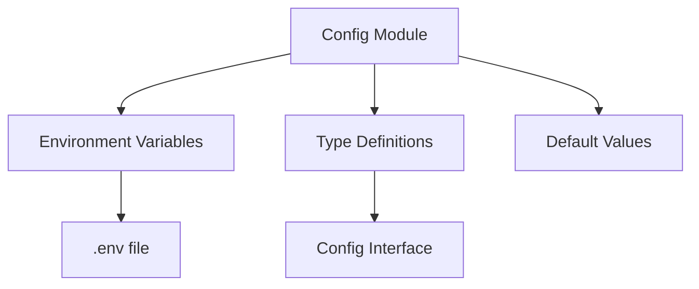

# Config Module

## 📋 Overview

This module centralizes all application configuration using environment variables. It provides type-safe access to configuration values throughout the application.

## 🎯 Purpose

- **Centralization**: Single source of truth for all configuration
- **Type Safety**: TypeScript interfaces ensure correct usage
- **Environment Aware**: Different configs for dev/prod environments
- **Security**: Sensitive data kept in environment variables

## 📁 Structure



## 🔧 Configuration Options

| Variable    | Type   | Default         | Description                 |
| ----------- | ------ | --------------- | --------------------------- |
| PORT        | number | 3000            | API server port             |
| NODE_ENV    | string | development     | Environment mode            |
| API_KEY     | string | development-key | API authentication key      |
| SESSION_DIR | string | ./sessions      | WhatsApp sessions directory |
| QR_TIMEOUT  | number | 60000           | QR code timeout in ms       |
| LOG_LEVEL   | string | info            | Logging verbosity           |

## 📖 Usage

```typescript
import { config } from '@config';

console.log(`Server running on port ${config.port}`);
```

## 🔒 Security Considerations

- Never commit `.env` files
- Use strong API keys in production
- Rotate keys regularly
- Limit environment variable exposure

## ✅ Best Practices

1. Always use typed config access
2. Provide sensible defaults
3. Validate critical values
4. Document all options
