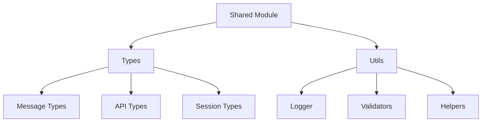

# Shared Module

## 📋 Overview

The shared module contains utilities, types, and common functionality used across the entire application. This promotes code reuse and consistency.

## 🏗️ Architecture



## 📁 Structure

```
shared/
├── types/          # TypeScript type definitions
│   └── index.ts    # Common interfaces
├── utils/          # Utility functions
│   └── logger.ts   # Logging configuration
└── README.md       # This file
```

## 🎯 Purpose

### Types

- **Type Safety**: Shared interfaces ensure consistency
- **Documentation**: Types serve as contracts
- **IDE Support**: Better autocomplete and error checking

### Utils

- **Logger**: Centralized logging with Pino
- **Reusability**: Common functions used everywhere
- **Consistency**: Standardized approaches

## 📖 Usage

### Using Types

```typescript
import { MessagePayload, ApiResponse } from '@shared/types';

const message: MessagePayload = {
  from: '5511999999999',
  text: 'Hello',
  timestamp: Date.now(),
  messageId: '123',
  type: 'text',
};
```

### Using Logger

```typescript
import { logger } from '@shared/utils/logger';

logger.info('Application started');
logger.error({ err: error }, 'Failed to connect');
```

## 🔧 Logger Configuration

The logger uses Pino for high-performance logging:

- Pretty printing in development
- JSON output in production
- Configurable log levels
- Structured logging support

## ✅ Best Practices

1. Always use shared types for consistency
2. Use logger instead of console.log
3. Add new shared utilities here
4. Keep utilities pure and testable
5. Document all exported functions

## 🧪 Testing

All shared utilities should have comprehensive tests:

```typescript
import { logger } from '@shared/utils/logger';

describe('Logger', () => {
  it('should log messages', () => {
    // Test implementation
  });
});
```
